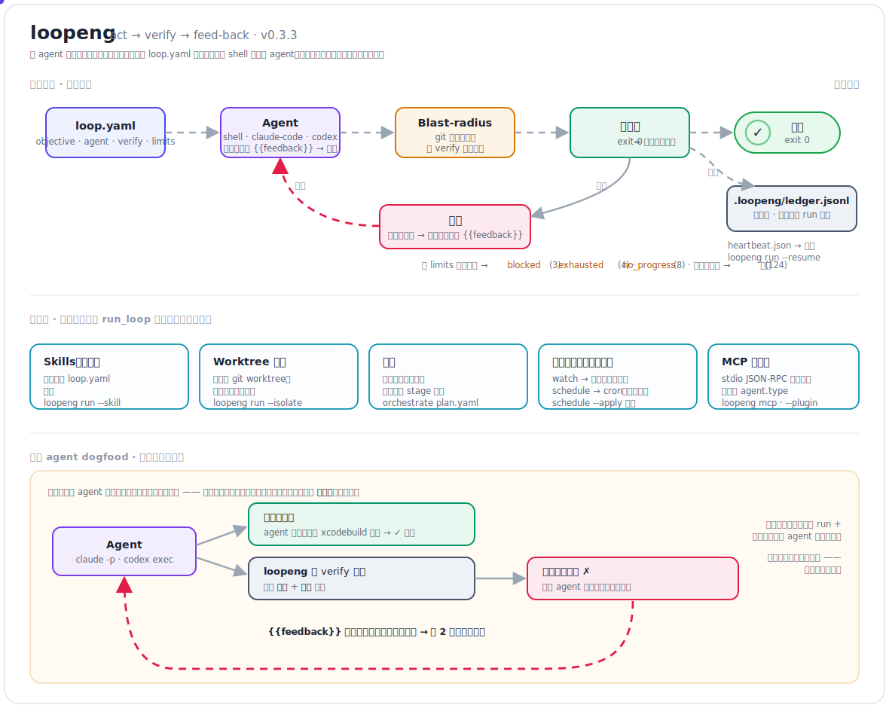

# loopeng

[English](README.md) · **简体中文**

一个**与 agent 无关的 Loop Engineering（循环工程）运行器**。它通过一个可移植的 `loop.yaml`
规格文件，驱动任意可由 shell 调用的编码 agent（Claude Code、Codex，或一个普通脚本）走完一个
有界的 `行动 → 验证 → 反馈`（act → verify → feed-back）循环。

它是一个小而经过充分测试的内核，融合了近期多个循环工程工具中已被验证的想法：**可移植的循环
规格**（ralphify）、**与 agent 无关的适配器**（loom）、**护栏 + 可审计的停止条件**（openloop）、
**确定性验证闸门**（Spotify “Honk” 研究中真正起作用的那一半），以及通过一份只追加（append-only）
账本实现的**对 git 友好的状态**。

<p align="center">
  
</p>

<p align="center"><sub><i>核心 <code>act → verify → feed-back</code> 循环、平台层，以及保留集反馈 dogfood。动画 SVG —— 静态图本身即可完整呈现。</i></sub></p>

## 安装

loopeng **未发布到 PyPI** —— 请从 GitHub release 或源码安装（要求 Python ≥ 3.9；除标准库 +
PyYAML 外没有运行时依赖）：

```bash
# 1) 从最新的 GitHub release 安装（无需 clone）：
pip install https://github.com/win4r/loopeng/releases/download/v0.3.3/loopeng-0.3.3-py3-none-any.whl
#    …或从 https://github.com/win4r/loopeng/releases 下载 wheel / .tar.gz，再安装本地文件：
#    pip install ./loopeng-0.3.3-py3-none-any.whl

# 2) …或从源码安装：
git clone https://github.com/win4r/loopeng && cd loopeng
pip install .                # 或： pip install -e ".[dev]"  用于开发检出 + 运行测试

loopeng --version            # loopeng 0.3.3
```

## 快速开始

```bash
loopeng init            # 脚手架生成 loop.yaml + samples/ + .loopeng/
loopeng run             # 运行示例循环（先失败一次，自我纠正，第 2 次迭代通过）
cat .loopeng/ledger.jsonl
```

脚手架生成的循环使用 `shell` agent（不需要 API key，也不产生任何计费）：一个 mock agent 先写入
`WIP` 再写入 `DONE`，验证器以“文件中包含 `DONE`”作为闸门。

## 工作原理

每一次迭代：

1. 渲染提示词模板 —— `{{objective}}`、`{{iteration}}`、`{{feedback}}`（上一次验证器的输出），
   以及任意 `` 的输出。
2. 运行 **agent** 适配器。提示词始终以 `$LOOPENG_PROMPT` 环境变量导出；`shell`/`mock` 适配器还会把它
   通过 **stdin** 传入，而 `claude-code`/`codex` 预设则把它作为 **CLI 参数**传入
   （`claude -p "<prompt>"` / `codex exec "<prompt>"`），并将 stdin 留空。
3. 运行**验证器** —— 退出码 `0` 即通过。这就是闸门。
4. 向 `.loopeng/ledger.jsonl` 追加一条迭代记录。
5. 通过 → `success`。失败 → 把验证器输出作为反馈传回，继续下一次迭代。

终止由多种方式约束（以下是主要几种；完整列表见 [退出码](#退出码)）：

| 结果 | 触发条件 | 退出码 |
|---|---|---|
| `success` | 验证器通过 | 0 |
| `blocked` | 连续失败达到 `max_consecutive_failures`（熔断器） | 3 |
| `exhausted` | 达到 `max_iterations` 仍未通过 | 4 |
| `no_progress` | 连续 `no_progress_limit` 次反馈完全相同的失败 | 8 |

按命令计的 `command_timeout` 会把卡死的 agent/验证器变成一次普通失败（退出码 `124`），因此循环
不会被卡住。

## 循环规格（`loop.yaml`）

```yaml
objective: "Write DONE into output.txt"
workspace: "."
agent:
  type: shell                 # shell | mock | claude-code | codex
  command: ["python3", "samples/mock_agent.py"]
prompt: |
  Objective: {{objective}}
  Verifier feedback from last attempt: {{feedback}}
verify:
  command: ["python3", "samples/verify.py"]
limits:
  max_iterations: 5
  max_consecutive_failures: 3
  command_timeout: 30
```

### 验证基线（可选的指标闸门）

在确定性的“退出码为 0”检查之上，还可以要求验证器满足一个数值阈值。`regex` 从验证器输出中提取
一个指标（取第一个捕获组，否则取整个匹配），并按 `direction` 与 `value` 比较。只有当验证器
**退出码为 0 且**基线成立时，该次迭代才算通过；否则基线未达标的原因会作为反馈传回 agent。

```yaml
verify:
  command: ["pytest", "--cov", "-q"]
  baseline:
    metric: coverage                 # 仅用于消息中的标签（默认 "metric"）
    regex: "TOTAL.* ([0-9.]+)%"       # 捕获用于比较的数字
    direction: greater_equal          # greater | greater_equal | less | less_equal | equal
    value: 90
```

基线只在验证器退出码为 0 时才会被检查（非 0 退出已经判定该次迭代失败）。指标缺失、非数值或非有限
（`inf`/`nan`）都会**判定闸门失败**。

### 上下文（即时输入）

`context` 在每次迭代时运行命令，并把它们的 stdout 作为 `{{name}}` 替换进提示词。两个
`limits`/逐条控制项让它保持克制：

```yaml
context:
  diff: "git diff --stat"                 # 每次迭代都重新运行（默认）
  layout: { command: "ls -R src", cache: true }   # 只运行一次，整个 run 复用
limits:
  context_max_chars: 4000                 # 替换前对每条 context 输出做截断
```

`cache: true` 只在第一次需要它的迭代运行该命令，之后复用其输出（失败的命令不会被缓存，因此会重试）；
`context_max_chars` 给每个被替换的值设上限，使提示词不会无限增长。

**正则小贴士**（指标字符串由你掌控）：`re.search` 返回**第一个**匹配，因此请把模式锚定到你想要的
那一行（例如 `TOTAL.* ([0-9.]+)%`）；如果指标可能为负，加上前导 `-?`；如果验证器可能输出科学
计数法，放宽字符类（例如 `[-+0-9.eE]+`）。`equal` 方向使用精确浮点相等 —— 对整数型指标
（例如 `errors == 0`）优先用它，分数型目标则用 `greater_equal`/`less_equal`。

## Agent

每个 agent 都是一条可由 shell 调用的命令，遵循同一份契约（输入：提示词/工作区/环境变量；
输出：stdout/stderr/退出码；控制：超时/环境/cwd；可选能力：resume / session_id /
approval_mode / sandbox）。

| `agent.type` | 默认调用方式 | 需要二进制？ | 它是什么 |
|---|---|---|---|
| `shell`（及 `mock`） | 原样执行你的 `command` | 否 —— 缺失的二进制在运行时表现为退出码 127 | 完全可用、经过测试的路径 |
| `claude-code` | `claude -p "<prompt>"` | **是** —— 循环开始前预检会在 PATH 上解析 `claude` | 对 Claude Code 无头模式的 CLI **封装** |
| `codex` | `codex exec "<prompt>"` | **是** —— 预检会在 PATH 上解析 `codex` | 对 Codex CLI 运行器的 CLI **封装** |

```yaml
# shell（默认）：运行任意命令
agent: { type: shell, command: ["python3", "samples/mock_agent.py"] }

# Claude Code CLI 封装。裸封装会解析 `claude`，但要让 agent 在无头模式下
# 能够编辑文件，你必须授予一个 permission mode（已验证：`acceptEdits`）：
agent: { type: claude-code, capabilities: { approval_mode: acceptEdits } }
agent: { type: claude-code, command: ["/opt/homebrew/bin/claude", "-p"] }

# Codex CLI 封装。`codex exec` 是非交互的；授予 `workspace-write` 让它能
# 编辑文件（若设置了 approval_mode，会通过 `-c approval_policy=<value>` 应用）：
agent: { type: codex, capabilities: { sandbox: workspace-write } }
```

> 裸写法 `{ type: claude-code }` / `{ type: codex }` 能解析并运行 CLI，但以 agent 的默认权限
> 通常无法修改工作区 —— 想要一个自主编辑的循环，请授予上面的 capabilities（或用你自己的
> `command:` 标志显式指定）。

**预检（preflight）。** 循环开始前，loopeng 会解析适配器的二进制。对 `claude-code`/`codex`
而言，缺失二进制会**快速失败**（退出码 `7`，账本事件 `adapter_preflight_failed`，心跳阶段
`failed`）—— agent、验证器、爆炸半径闸门都不会运行。`shell` 适配器不要求其二进制存在（缺失时
只是变成一次普通的退出码 127 失败）。无需真正运行即可检查就绪状态：

```bash
loopeng doctor                 # 使用 ./loop.yaml
loopeng doctor --json          # {"adapter_type": "...", "binary": "...", "resolved_path": "...", "ok": true/false}
# 退出码：0 就绪 · 7 二进制缺失/不可执行 · 2 spec 缺失/非法或适配器构建错误
```

**明确的局限：** `claude-code` 与 `codex` 是 **CLI 封装，而非深度 API 集成** —— loopeng 通过
shell 调用已安装的 CLI，并把提示词作为参数传入。capability→标志 的映射是尽力而为；请用 `command:`
钉死参数，或对照你安装的 CLI 版本确认标志。

## 安全模型

loopeng 可以施加**爆炸半径（blast-radius）控制** —— 这是一个**仓库写入集闸门**，而非安全沙箱。
在 agent 运行之后（且在验证器*之前*），loopeng 会询问 git 发生了哪些变更，如果变更集超出你声明的
边界，就拒绝该次迭代。请在 `limits:` 下配置：

```yaml
limits:
  max_iterations: 5
  max_consecutive_failures: 2
  timeout_seconds: 60

  require_clean_git: true        # 循环开始时若工作树有未提交改动则尽早失败
  max_changed_files: 10          # 限制一次 run 最多可触碰多少路径
  allowed_paths:                 # 若设置，则每个变更路径都必须匹配其中之一
    - "src/**"
    - "tests/**"
    - "README.md"
  forbidden_paths:               # 任一匹配到的变更路径都会使该次迭代失败
    - ".env"
    - ".env.*"
    - "secrets/**"
    - "infra/prod/**"
    - "pyproject.toml"
    - "uv.lock"
```

模式是**相对工作区**书写的。`allowed_paths`/`forbidden_paths` 的 glob 示例（如 `src/**`、
`.env`）会在 agent 的改动被规范化为相对工作区路径之后进行匹配。

**它的行为**

- `require_clean_git: true` → 若循环开始时工作树有未提交改动，run 会**尽早中止**（退出码 `5`，
  账本事件 `blast_radius_precondition_failed`），从而不会把既有改动错记到 agent 头上。
- 每个 agent 步骤之后，loopeng 用 `git status --porcelain -z --untracked-files=all` 计算
  agent 的变更集（因此新建目录内的单个文件会被逐一列出，且**未跟踪、已删除、重命名**的文件都计入 ——
  而不仅仅是 `git diff`），并相对循环开始时的基线计算。
- 命中 `forbidden_paths`、落在非空 `allowed_paths` 之外，或超过 `max_changed_files` 的变更即为
  **`blast_radius_violation`**：该次迭代失败、跳过验证器、把违规记入账本，并且**计入
  `max_consecutive_failures`**（因此反复违规会触发熔断 → `blocked`）。违规细节会作为反馈传入下一次
  提示词，于是 agent 可以通过撤销违规改动来自我纠正。

路径匹配采用 gitignore-lite 规则：`**` 跨目录，`*` 限于单个路径段内，`?` 匹配单个非分隔符字符。

**明确的局限。** 这**不是安全沙箱**。它只在 agent 运行*之后*观察 git 工作树，且仅当工作区是一个
git 仓库时才生效（否则闸门会被跳过并给出警告）。它**不会**阻止网络访问、数据被读取或外发、向仓库
之外写入、或破坏性命令 —— 它只约束**仓库写入集**。具体而言：它匹配的是路径字符串，**不解析符号
链接**，因此 agent 可以在某个被允许的路径下创建一个符号链接，并通过它向仓库之外写入而不触发闸门；
而 `.git/` 内部对 `git status` 不可见，因此无法用 `forbidden_paths` 约束。要做到真正隔离，请在
容器、虚拟机或专用沙箱中运行 agent。

**读取尚未被限制。** 这个闸门是*写入集*闸门。loopeng **不**限制 agent 能**读取**什么：一个 agent
（例如 `claude -p --dangerously-skip-permissions`）能读取该进程能读取的任意文件 —— 你的源码、
其它仓库、`$HOME`、继承的环境变量、密钥。因此，依赖某个隐藏或*保留（held-out）*文件的验证器，
其“隐藏”只是**约定，而非强制**（见
[真实 agent dogfood](#真实-agent-dogfood--保留集-held-out-反馈屏障)）。限制 agent 的**读取**（以及其
**网络**访问）需要一个 OS 级沙箱 —— 这是**已规划的路线图工作**（见[路线图](#路线图)），而非写入集
闸门今天所做的事。作为一道护栏：自 v0.3.3 起，放在
`limits:` 之外的顶层爆炸半径键会被**拒绝**（抛出 `SpecError`），因此一个嵌套位置写错的闸门不会
悄无声息地变成空操作。

## 恢复与实时状态

一次 run 的账本是**可恢复的状态**，而不仅是审计日志。每次 run 都有稳定的 `run_id`，每次迭代都连同
其迭代号和连续失败计数被记录下来，因此被中断或耗尽的 run 可以继续。

```bash
loopeng run                      # …被中断，或耗尽 max_iterations
loopeng run --resume             # 从账本中最近一次 run 的下一次迭代继续
loopeng run --resume --max-iterations 20   # …并给更多迭代空间
loopeng run --resume --force     # 覆盖一个 'blocked' run 或已变更的 spec
```

**恢复会还原**迭代计数器与连续失败计数器（使熔断器把中断前的失败也计入），并在**同一个 `run_id`**
下继续。

**恢复被拒绝（退出码 `6`）的情形：**

| 条件 | 覆盖方式 |
|---|---|
| 不存在账本 | —— |
| 账本中没有可恢复的 run | —— |
| 最近一次 run 已经**成功** | —— |
| 最近一次 run 以 **`blocked`** 结束 | `--force` |
| 最近一次 run 以 **`no_progress`** 结束 | `--force` |
| 某次 run 仍**存活**（心跳未过期、阶段非终态） | `--force` |
| 自那次 run 以来 spec **指纹已变更** | `--force` |

**spec 指纹**是对 spec *语义*的哈希 —— 解析后 `loop.yaml` 的每个字段（objective、prompt、agent、
verify、workspace、context、limits、blast-radius）—— 而非其格式/注释。两次 run 之间改动其中任意一项
都会触发不匹配保护，使你不会拿一个它从未见过的 spec 去恢复某次 run；`--force` 可覆盖。（改变 agent
所观察的世界 —— 磁盘上的文件、环境 —— **不会**改变指纹，因此正常的 中断→修复→`--resume` 流程照常
工作。）

**恢复时的爆炸半径：** 闸门在*每次*调用开始时都会相对工作树重新设定基线，因此 `max_changed_files`
约束的是*被恢复的那一段*，而非整个逻辑 run 的累计量（这是有意为之 —— 它使你在两次 run 之间手工做的
修复不会被错记到 agent 头上）。`forbidden_paths`/`allowed_paths` 仍然在每一段上逐文件强制执行。
`require_clean_git` 只适用于全新的 run；在 `--resume` 时，那棵“脏”工作树是上一段自己的产出，会被接受。

### 实时状态

run 进行中（或结束后），`.loopeng/heartbeat.json` 记录它走到了哪里。查询它：

```bash
loopeng status            # 人类可读摘要
loopeng status --json     # 一个稳定的 JSON 对象（run_id、phase、iteration、stale 等）
loopeng status --dir path/to/project
```

心跳在每个阶段都被原子地重写（`starting`、`gathering_context`、`running_agent`、
`checking_blast_radius`、`verifying`、`writing_ledger`，以及终态 `completed`/`blocked`/`failed`）。
字段：`run_id, pid, cwd, spec_path, spec_fingerprint, phase, iteration, max_iterations,
consecutive_failures, started_at, updated_at, last_event, heartbeat_schema_version`。当记录的
`pid` 已不存活时，`status` 报告 **`stale: true`** —— 存活的 pid 具有权威性，因为心跳只在阶段之间
刷新，而单个阶段合法情况下最长可运行到 `command_timeout`。当没有记录 pid 时，则回退到 `updated_at`
的年龄阈值（30 秒）。（注意：pid 复用在极少数情况下会让一个已崩溃 run 的回收 pid 被读成存活。）

### 类型化事件

运行器内部发出类型化的事件字典（`run_started`、`iteration_started`、
`agent_started`/`agent_completed`、`blast_radius_started`/`_passed`/`_violation`、
`verify_started`/`_passed`/`_failed`、`iteration_failed`、`run_completed`/`_blocked`/`_failed`、
`resume_started`/`_loaded`/`_refused`、`adapter_preflight_passed`/`_failed`、
`no_progress_detected`、`heartbeat_written`，等等）。每个事件都带有 `type`、`run_id`、`ts`，且可
JSON 序列化，因此与账本兼容。CLI 会把它们渲染成与以往一致的人类可读输出 —— 或者，加上 `--json`，
原样流式输出：

```bash
loopeng run --json    # stdout 上每行一个 JSON 事件（无人类摘要）；可管道接入监督进程
```

### 停滞与无进展检测

两个可选的 `limits` 用于停止一个在运行但没有进展的循环：

```yaml
limits:
  no_output_timeout: 60   # 若 agent 60 秒没有任何输出则杀掉它（静默挂起，区别于 command_timeout）；
                          # 记录为 agent_stalled。仅 POSIX。
  no_progress_limit: 3    # 在连续 3 次失败迭代、其反馈逐字节相同后，以 no_progress 状态（退出码 8）
                          # 停止 —— 反馈可以是验证器输出，或一条重复的爆炸半径违规消息
                          # （“没有新证据”）—— 比连续失败熔断器更紧。
```

### 运行中调向

`loopeng run --reload-spec` 在每次迭代开始时重新读取 `loop.yaml`，并采纳被编辑过的**提示词** ——
于是你可以在一个长时间 run 进行中通过编辑该文件来给它调向，而无需停止它：

```bash
loopeng run --reload-spec      # 然后编辑 loop.yaml 的 prompt；下一次迭代就会使用它
```

只有提示词的**字面文本**会被热重载（agent、verify、limits 与安全控制在 run 开始时即固定；像
`{{objective}}` 这样的模板变量仍相对 run 开始时的 spec 解析）。编辑中途被读到的非法 spec ——
包括部分写入/二进制写入或原子重命名竞态 —— 会被忽略（事件 `spec_reload_failed`），从而循环继续
使用最后一个好的提示词；一次成功的改动会发出 `prompt_steered`。编辑 spec 会改变其指纹，因此之后
对一个被调向过的 run 执行 `--resume` 需要 `--force`。

> **注意：** 使用 `--reload-spec` 时，一个能写入 `loop.yaml` 的 agent 可以改写它自己的提示词。
> agent 仍然无法改变 agent/验证器/limits/爆炸半径（它们在 run 开始时即冻结），但如果这种自我调向
> 对你重要，请把 `--reload-spec` 与一个爆炸半径 `allowed_paths`（或针对 `loop.yaml` 的一条
> `forbidden_paths`）搭配使用。

### 退出码

`0` 成功 · `2` spec/适配器错误 · `3` blocked · `4` exhausted ·
`5` 前置条件失败（设置了 `require_clean_git` 时工作树有未提交改动）· `6` 恢复被拒绝 ·
`7` 适配器预检失败（配置的 agent 二进制未找到）·
`8` 无进展（反馈相同的失败达到 `no_progress_limit`）。

## 平台层（v0.3.0）

这些层都构建在同一个 `run_loop` 内核之上，并保持**默认安全**：每一个对外动作都是显式、本地、由
用户配置的。loopeng 只会 shell 调用你自己写进 `loop.yaml` / `plan.yaml` / hooks 的命令，或你显式
加载的插件代码 —— 没有任何隐藏的网络、凭据或远程执行路径。

### 可复用技能（skills）

一个*技能*就是一个带参数的 `loop.yaml` 模板（用 `skill:` 块声明参数）。渲染器只替换你声明的
`{{param}}`，并把 `{{feedback}}` / `{{iteration}}` 留给运行器。

```bash
loopeng skill list                 # bundled + ~/.loopeng/skills/ + ./.loopeng/skills/
loopeng skill show fix-until-tests-pass

# 无 agent 演示（纯 shell，不产生任何计费）：
loopeng run --skill shell-converge --set agent_cmd="echo x >> p.txt" --set verify_cmd="test -s p.txt"

# 真实编码 agent（⚠ 会启动一个实时、计费的 claude/codex run 并编辑文件）：
loopeng run --skill fix-until-tests-pass --set test_cmd="pytest -q"
```

> ⚠ `fix-until-tests-pass` 默认使用真实的 `claude-code` agent：运行它会启动一个自主、计费的
> agent 来编辑你的文件（最多到它的迭代上限）。用 `--isolate` 把它关进一个一次性 worktree，或用
> `shell-converge` 做一个纯本地、不计费的演示。

发现优先级：项目 `.loopeng/skills/` > 用户 `~/.loopeng/skills/` > 内置。缺失的必填参数和未知的
`--set` 键都是硬错误（不会悄悄跑错循环）。某个 skills 目录里的一个畸形文件会被跳过并给出警告 ——
它绝不会拖垮其它文件。渲染后的 spec 会写入 `.loopeng/skill-<name>.rendered.yaml` 以便透明查看。

`.loopeng/skills/` 下的项目技能是值得提交的真实资产，而 `.loopeng/` 的其余部分是运行时状态（账本、
心跳、渲染后的 spec）。`loopeng init` 会脚手架生成一个 `.loopeng/.gitignore`，提交 `skills/` 而忽略
运行时状态，于是你不必手工调你的根 `.gitignore`。

### Worktree 隔离（`run --isolate`）

在一个从 `HEAD` 切出的一次性 **git worktree** 中运行循环，使你的主工作树完全不被触碰。成功时，agent
的改动会被提交到一个可丢弃的 `loop/<hex>` 分支上，diff 会被展示出来，worktree 目录被移除（分支保留，
便于你 `git merge`）；失败时一切都被丢弃。

```bash
loopeng run --isolate              # 需要一个至少有一次 commit 的 git 仓库
```

这是为*你自己*做实验提供的便利/安全边界，而非安全沙箱（见**安全模型**）。它绝不会强制移除你的主检出。

### 自动化触发器（无守护进程）

```bash
loopeng watch --pattern "src/**/*.py" --pattern "tests/**/*.py"   # 文件变更时重跑
loopeng schedule --cron "*/30 * * * *" --marker nightly           # 干跑：打印该行
loopeng schedule --cron "*/30 * * * *" --marker nightly --apply   # 安装进你的 crontab
```

`watch` 是一个**前台**进程（无守护进程）：它轮询文件 mtime，对成串的编辑做去抖，忽略
`.loopeng/`/`.git/`/`__pycache__`/`.venv` 以避免自我触发，并在 Ctrl-C 时退出。不带 `--apply` 时，
`schedule` 是纯**干跑**：它读取你当前的 crontab 并把**合并后的结果**（你已有的条目加上新的
`# loopeng:<marker>` 行）打印到 stdout —— 它什么都不写。只有 `--apply` 才会把那一行幂等地（以
`--marker` 为键）插入/更新到你自己的用户 crontab。

### 多阶段编排（`orchestrate plan.yaml`）

一个 `plan.yaml` 把多个循环连成一个 DAG；每个阶段本身就是一个完整的 loopeng 循环。

```yaml
version: 1
workspace: shared          # 或 "worktree" —— 把整个 plan 从 HEAD 切出隔离
fail_fast: true
stages:
  lint:  { loop: { objective: "...", agent: {type: shell, command: ["sh","-lc","ruff check --fix ."]}, prompt: "{{feedback}}", verify: {command: ["sh","-lc","ruff check ."]}, limits: {max_iterations: 3} } }
  test:  { needs: [lint], skill: fix-until-tests-pass, set: { test_cmd: "pytest -q" } }
  docs:  { needs: [lint], spec: ./docs/loop.yaml }
```

```bash
loopeng orchestrate --plan plan.yaml          # 退出码 0 全部通过，1 有失败，2 plan 非法
loopeng orchestrate --plan plan.yaml --json
```

同一层级内相互独立的阶段并发运行；某阶段只有在它所 `needs` 的每个阶段都成功之后才运行；某阶段若其
依赖失败则被**跳过**（这本身不算失败）。每个阶段的循环都是同一个带闸门的 act→verify 循环，因此同样的
护栏与爆炸半径控制按阶段生效。由于爆炸半径闸门读取的是整棵树的 `git status`，含有任一受爆炸半径门控
阶段的层级会**串行**运行（以便正确归属每个阶段的写入集）；未门控的层级则并行。每次 run 的账本落在
`.loopeng/orchestrate-<id>.jsonl`。

### 生命周期 hooks / 连接器

一个 `hooks:` 块会在循环事件上运行你自己的本地 shell 命令 —— 便于做通知或 CI 粘合。失败或缓慢的 hook
会被隔离（受超时约束），并且**绝不改变循环结果**。

```yaml
hooks:
  on_start:     ["echo started $LOOPENG_RUN_ID"]
  on_iteration: ["./record.sh"]
  on_success:   ["curl -fsS -X POST https://example/done"]   # 你的端点，你的决定
  on_failure:   ["./alert.sh"]
```

每条命令都通过 `sh -lc` 运行，环境中带有 `LOOPENG_EVENT`、`LOOPENG_STATUS`、`LOOPENG_RUN_ID`、
`LOOPENG_ITERATION` 与 `LOOPENG_EVENT_JSON`。hooks 就是你写进 spec 的那些命令 —— 不会运行任何你没
放进去的东西。

### 适配器插件

无需 fork loopeng 即可注册一个自定义 `agent.type`，途径是 `loopeng.adapters` entry-point 组
（已安装的包）或显式的 `--plugin`：

```bash
loopeng run --plugin ./my_adapter.py        # 你指向的一个本地 .py 文件
loopeng run --plugin my_pkg.adapter         # 一个可导入的模块
```

一个插件模块暴露 `register(registry)`，把一个类型名映射到一个 builder。entry-point 插件是
**失败隔离**的（坏掉的插件只是一个警告，而非崩溃）；你显式命名的 `--plugin` 则**严格**加载（坏路径
是硬错误）。插件就是你选择加载的普通本地 Python —— 请像对待任何你安装的依赖那样对待它。

### MCP 服务器（`loopeng mcp`）

把 loopeng 通过 **stdio** 暴露给一个 MCP 客户端（Claude Code / Codex），形式为本地、以换行分隔的
JSON-RPC 2.0（MCP `2025-03-26`）。工具：`loopeng_list_skills`、`loopeng_doctor`、
`loopeng_status`、`loopeng_run`。

```jsonc
// .mcp.json（Claude Code）—— 一个你主动选用的本地 stdio 服务器
{ "mcpServers": { "loopeng": { "command": "loopeng", "args": ["mcp"] } } }
```

它是一个在 stdin/stdout 上对话的本地子进程 —— 没有网络监听器，没有远程端点。它只运行你的
skills/specs 定义的循环，处于同样的护栏之下。

## 从 agent 驱动 loopeng（三个层次）

“技能/skill”一词容易混淆，所以要说清楚：loopeng 在**三个互补的层次**与 AI agent 相遇 —— 一个
可复用的*规格*、一个 agent 的*判断*、以及一个机器*接口*。它们不是互相替代，而是层层叠加。

| | **loopeng YAML 技能** | **Claude Code 技能** | **`loopeng mcp`** |
|---|---|---|---|
| 它是什么 | 一个带参数的 `loop.yaml` 模板（一个 `skill:` 块 + `params`） | 一个 `SKILL.md`，教 agent *驱动* loopeng 的工作流与坑 | 一个 MCP 服务器（stdio JSON-RPC，`2025-03-26`），把 loopeng 的动作作为工具暴露 |
| 层次 | **规格** —— 运行*什么*循环 | **判断** —— *何时 / 如何*安全地循环 | **接口** —— 任意 agent *如何*调用 loopeng |
| 由谁消费 | loopeng 运行时（`loopeng run --skill`，或 `loopeng_run`） | Claude Code（自动发现；`/loopeng`） | 任意 MCP 客户端（Claude Code、Codex…） |
| 位于 | `.loopeng/skills/` > `~/.loopeng/skills/` > 内置（优先级） | `~/.claude/skills/loopeng/`（来自 [`integrations/claude-code-skill/`](integrations/claude-code-skill/)） | 一个子进程：`loopeng mcp` |
| 给你 | 复用 —— 一次固定循环，按次传参 | 程序性知识 —— `--isolate`、机械式反作弊、诚实报告 | 工具 —— `loopeng_list_skills` / `_doctor` / `_status` / `_run` |
| 详见 | 上文「可复用技能（skills）」 | [`integrations/claude-code-skill/`](integrations/claude-code-skill/) | 上文「MCP 服务器」 |

**它们如何互补。** 一个 **YAML 技能**是可复用的规格 —— *什么*。**MCP 服务器**把 loopeng 的动作
（包括通过 `loopeng_run` 运行一个 YAML 技能）以标准协议暴露给*任意* agent —— *如何调用*。
**Claude Code 技能**给 Claude agent *判断*：何时该用循环、优先 `--isolate`、让反作弊机械化、并
报告退出码 + 验证器输出 + 分支 + 风险 —— *何时 / 如何决策*。所以：Claude Code 技能（或人）
**决策并驱动**；CLI 或 `loopeng mcp` **执行**；一个 YAML 技能往往就是被*执行*的东西。技能**教**、
协议**暴露**、模板**复用** —— 三者都在同样的护栏下运行同一个带闸门的 `run_loop` 内核。非 Claude
的 agent 通过 **CLI + `loopeng mcp`**（通用的机器接口）变得「loopeng 可用」；**Claude Code 技能**
是其上的 Claude 原生层。

## 真实 agent dogfood + 保留集 held-out 反馈屏障

loopeng 通过驱动**真实**编码 agent 去对付一个真实项目的构建与测试套件（而非 mock），做了端到端验证。
用 `agent: { type: claude-code, command: ["claude","-p","--dangerously-skip-permissions"] }`
（以及一次用 `codex` 预设的并行 run），loopeng 反复地通过一个确定性验证器闸门修好了一个被故意弄坏的
构建/测试。

两条值得带进你自己循环的发现：

- **以*你的*验证器为闸门，并让反作弊是结构性的。** loopeng 始终运行它自己的 `verify` 并以*它*为闸门
  （agent 的退出码会被记录，但从不被信任）。一个跑测试的验证器仍然是*可被作弊的* —— agent 可以通过
  改测试来“修好”一个失败的测试。光靠提示词指令不够；请使用**机械式**护栏
  `limits.allowed_paths: ["src/**"]`（白名单严格强于 `forbidden_paths` 黑名单）。写入集闸门在
  verify **之前**运行，因此对应用源码之外的编辑就是一次 `blast_radius_violation`，run 会失败 ——
  于是一次绿色 run 就证明了这是一处真实的源码修复。

- **让 `{{feedback}}` 真正起承载作用（保留集屏障）。** 像 `claude -p` 这样的自我验证 agent 会在
  *它自己的回合内*运行整个测试套件，因此“一个编译错误掩盖了一个测试失败”**并不会**强制出现第二次
  迭代 —— agent 早已同时看到两者。要证明反馈通道确实在承载信息，就把第二条需求**机械式**地藏起来：
  告诉 agent 去运行*公开*验证器，而 loopeng 的 `verify` 额外运行一个**保留**测试，它位于 agent
  所编译目标*之外*、并且位于其工作区*之外*（通过验证器读取的一个环境变量来托管），钉死一条 **agent
  无法推断的任意规则**。agent 在第 1 次迭代满足公开契约，却无从得知那条保留规则；loopeng 把保留测试
  的失败反馈回去；第 2 次迭代 agent 实现了一条**只能从 `{{feedback}}` 学到**的规则。我们用一次真实的
  两迭代 claude run 以及一次独立的多 agent 审计确认了这一点（第 1 次迭代的 transcript 里没有任何那条
  规则的踪迹；它首次出现是在第 2 次迭代那条承载反馈的提示词里）。这不需要改动 loopeng —— 一个任意的
  `verify` 命令 + `{{feedback}}` 中继本身就足以表达一个保留集信息屏障。

  **注意（呼应[安全模型](#安全模型)）：** 这个屏障只在*按上述配置时*才是密闭的 —— 把保留文件托管在
  工作区之外，并让它不进入被提交的 run 分支。由于 loopeng **不限制读取**，一个极尽进取的 agent 可以
  读取验证器脚本并顺着环境变量找到那个保留文件。一个真正的硬性保证需要在 agent 周围加一层 OS 级文件
  系统沙箱（尚未实现）。

## 路线图

**已规划**

- **agent 的 OS 级读取限制 + 网络沙箱。** 爆炸半径闸门只约束 git *写入集* —— 它不限制 agent
  **读取**什么、也不限制它能否访问**网络**（见[安全模型](#安全模型)）。规划中的选项会在一个 OS 级
  沙箱（文件系统读取限制 + 网络出站控制）中运行 agent，从而让一个保留文件或密钥靠**强制**而非约定
  来隐藏，且隔离不再依赖 `--isolate` + 信任。

**尚未构建（有意排除在范围之外）**

- **PyPI 发布** —— 安装是从 GitHub release 或源码进行（见[安装](#安装)）。
- 守护进程/长驻服务模式、Web UI，以及一个深度（非 CLI）的 Claude/Codex API 集成。

## 许可证

[MIT](LICENSE)。发布历史见 [CHANGELOG](CHANGELOG.md)。
